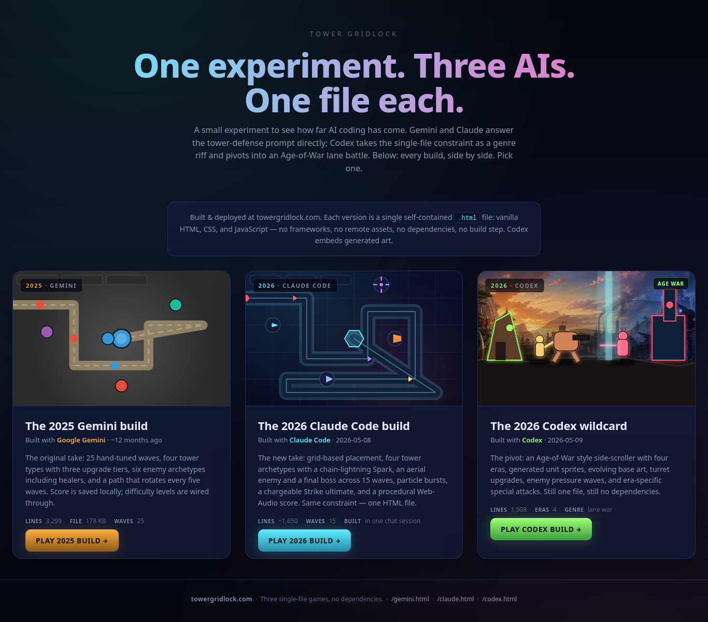

# Tower Gridlock

Tower Gridlock is a static HTML game experiment comparing several single-file
AI-made builds. Each playable build lives at the repository root as a standalone
HTML file with inline CSS and JavaScript. There is no framework, package
manager, build step, or server requirement.



## Builds

- `index.html` - build chooser for the available versions.
- `gemini.html` - original 2025 Gemini build. This is the classic wave-based
  tower-defense game with pathing, tower placement, upgrades, enemy waves,
  difficulty settings, speed controls, high score persistence, and procedural
  audio.
- `claude.html` - 2026 Claude Code reimplementation. This is a separate
  grid-based tower-defense build with neon visuals, 15 waves, difficulty
  selection, tower upgrades, pause/settings controls, and local save data.
- `codex.html` - 2026 Codex wildcard. This keeps the single-file constraint but
  pivots into an Age of War style lane battle with four eras, trainable units,
  evolving bases, turret upgrades, special attacks, and embedded generated art.

The builds do not share code. Treat each HTML file as its own self-contained
application unless a broader refactor is intentional.

## Running Locally

Open the chooser directly:

```sh
xdg-open index.html
```

Or open a specific build:

```sh
xdg-open gemini.html
xdg-open claude.html
xdg-open codex.html
```

Serving the directory is optional, but useful for browser testing:

```sh
python3 -m http.server 8000
```

Then visit `http://localhost:8000/`.

## Gameplay Summary

### Gemini Build

The Gemini build is the original tower-defense implementation. Place Basic,
Sniper, Cannon, and Freeze towers around a changing enemy path, survive 25
waves, upgrade towers through multiple levels, and use a charged bomb ability
when the screen gets crowded. Enemies include ground units, flyers, armored
units, tanks, fast enemies, and healers. The active path changes every 5 waves,
partially refunding towers and forcing a rebuild.

### Claude Build

The Claude build is a separate 2026 tower-defense game with a grid placement
model, 15 waves, three difficulty levels, wave rewards with interest, keyboard
shortcuts, audio controls, and a local save for best run and settings. It uses a
different codebase and game loop from the Gemini build.

### Codex Build

The Codex build is a lane-war variant inspired by Age of War. Train melee,
ranged, and heavy units, manage gold and experience, evolve through Stone, Iron,
Steam, and Neon eras, add turret defense, and use era-specific specials to break
the enemy base. Generated artwork is embedded directly into the HTML so the page
still runs as a single file.

## Project Structure

```text
.
|-- index.html          # Build chooser
|-- gemini.html         # Original Gemini tower-defense build
|-- claude.html         # Claude Code tower-defense build
|-- codex.html          # Codex lane-war build
|-- images/
|   `-- screenshot.png  # README screenshot
|-- CLAUDE.md           # Architecture notes for agents
|-- LICENSE             # MIT license
`-- README.md
```

## Development Notes

- Keep each build self-contained unless a task explicitly asks for shared code.
- Prefer editing declarative game data tables for balance changes before
  changing loop or rendering logic.
- The game pages use `localStorage` for settings, saves, or high scores. Clear
  relevant keys in DevTools when testing first-run behavior.
- Generated source assets are not needed at runtime when they have already been
  embedded into the HTML.

## Manual Testing

There is no automated test suite. For gameplay changes, check:

- the page loads directly from disk and through `python3 -m http.server`
- startup and restart flows
- tower placement or unit training
- wave or enemy progression
- pause, settings, speed, and audio controls
- game-over and victory states
- responsive sizing on desktop and mobile widths
- `localStorage` save, settings, or high score behavior

## License

This project is licensed under the MIT License. See [LICENSE](LICENSE).
